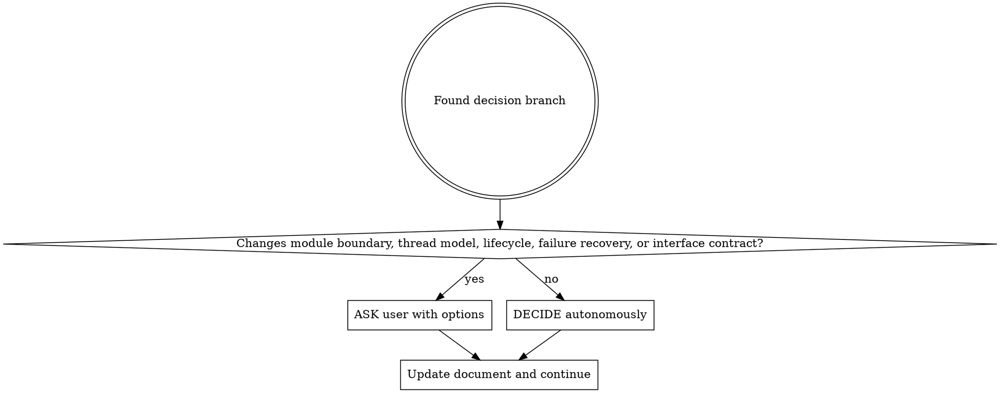

# Ask Me

## Overview

A technique for refining design documents by asking the user ONLY about architectural decisions that change system structure. The AI decides everything else autonomously.

## When to Use

- After completing an initial draft of a design or plan document
- When architectural decisions need user input
- Before implementing based on a document

## When NOT to Use

- Before any draft exists (use brainstorming skill first)
- For simple, straightforward tasks that don't need documentation

## Core Principle: Converged Questioning Scope

**ONLY ask the user about branches that change:**

| Category | What It Means | Example Questions |
|----------|---------------|-------------------|
| **Module boundaries** | Where responsibilities are divided, what each module owns | "Should audio buffer management live in voice/ or manager/audio/?" |
| **Thread model** | Which threads exist, what runs where, synchronization approach | "Should PTT processing use dedicated thread or shared worker pool?" |
| **Lifecycle** | When things start/stop, who owns creation/destruction | "Who initializes media session: SIP stack or call manager?" |
| **Failure recovery** | What happens when things fail, retry/rollback strategies | "On network disconnect, should calls auto-reconnect or notify user?" |
| **Cross-module interface contracts** | API boundaries between modules, data ownership | "Should audio module push samples or should voice pull?" |

**Agent decides autonomously (do NOT ask):**
- Implementation details within a module
- Variable/function naming
- Internal data structures (unless they leak across boundaries)
- Algorithms and optimization approaches
- Error message wording
- Logging format and level
- Code organization within files

## Core Pattern

```
Read document → Identify ARCHITECTURAL branches → For each branch:
  Explore codebase → Present options → Get user answer → Update document → Confirm → Next branch
```

**Key rules:**
1. **One branch at a time** - Do not advance until current branch is resolved
2. **Explore first** - Always explore codebase before asking; answer may already exist
3. **Present options** - Provide concrete options with trade-offs
4. **Immediate updates** - Write to document as soon as each fact is clarified
5. **User confirmation** - Branch is resolved only when user confirms
6. **Decide autonomously** - If it's not in the 5 categories, Agent picks the best approach

## Decision Flow



## Completion Criteria

The process ends when:
- All ARCHITECTURAL branches have been resolved
- Document reflects all decisions (both user-guided and autonomous)

## Common Mistakes

| Mistake | Correct Approach |
|---------|------------------|
| Asking about implementation details | Decide autonomously; only ask about architectural boundaries |
| Asking without exploring codebase first | Always explore; the pattern may already exist |
| Batching questions | Ask one architectural question, resolve, then next |
| Asking too many questions | Most decisions should be autonomous; if asking >5 questions, reconsider scope |
| Not documenting autonomous decisions | Record what you decided and why in the document |
